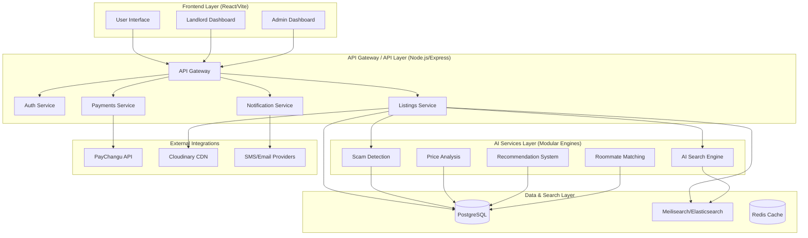

# LUNDAI System Architecture Design

LUNDAI is a production-ready, scalable AI-powered housing discovery platform designed for rapid expansion across Malawi and other African markets.

## 1. System Architecture Diagram

## 2. Technology Stack Overview

| Layer | Technology |
| :--- | :--- |
| **Frontend** | React 18, TypeScript, Vite, TailwindCSS, Framer Motion |
| **Backend** | Node.js, Express, TypeScript |
| **AI/ML** | Python (FastAPI) for specialized engines, Gemini API for NLP |
| **Primary Database** | PostgreSQL (Managed) |
| **Caching** | Redis |
| **Search Index** | Meilisearch (optimized for speed/low-resource) |
| **Media Storage** | Cloudinary (Media CDN) |
| **Payments** | PayChangu (Malawi Local Gateway) |
| **Infrastructure** | Docker, Kubernetes (EKS/GKE), Terraform |
| **CI/CD** | GitHub Actions |

## 3. Microservices Breakdown

### Core Services
1.  **Auth Service**: Handles JWT-based authentication, RBAC (User, Landlord, Admin), and session management.
2.  **Listings Service**: Manages property CRUD, verification workflows, and metadata.
3.  **Payments Service**: Integrates with PayChangu for contact unlocking, listing promotions, and subscriptions.
4.  **Notification Service**: Asynchronous service for Email, SMS, and In-app alerts using a message queue (RabbitMQ/Redis).

### AI Engines (Modular)
1.  **AI Search Engine**: Natural language processing of search queries to match intent with property features.
2.  **Scam Detection Engine**: Analyzes listing patterns, metadata, and landlord behavior to flag high-risk posts.
3.  **Price Analysis Engine**: Compares listings against neighborhood benchmarks to provide "Fair Price" indicators.
4.  **Recommendation System**: Personalized property feeds based on user browsing history and preferences.
5.  **Roommate Matching Engine**: Algorithmic matching of students based on lifestyle, budget, and university affiliation.

## 4. Database Schema Overview (PostgreSQL)

### Users Table
- `id` (UUID, PK)
- `email` (String, Unique)
- `password_hash` (String)
- `role` (Enum: STUDENT, LANDLORD, ADMIN)
- `is_verified` (Boolean)
- `profile_data` (JSONB)
- `created_at` (Timestamp)

### Properties Table
- `id` (UUID, PK)
- `landlord_id` (FK -> Users)
- `title` (String)
- `description` (Text)
- `price` (Decimal)
- `location` (Point/Geography)
- `city` (String)
- `neighborhood` (String)
- `property_type` (Enum)
- `amenities` (JSONB)
- `status` (Enum: PENDING, ACTIVE, REJECTED)
- `trust_score` (Integer)

### Listings Table
- `id` (UUID, PK)
- `property_id` (FK -> Properties)
- `is_featured` (Boolean)
- `promotion_expiry` (Timestamp)
- `view_count` (Integer)

### Payments Table
- `id` (UUID, PK)
- `user_id` (FK -> Users)
- `amount` (Decimal)
- `status` (Enum: SUCCESS, FAILED, PENDING)
- `transaction_ref` (String)
- `type` (Enum: UNLOCK, PROMOTE, SUBSCRIPTION)

## 5. Deployment Architecture

### Cloud Infrastructure
- **Containerization**: All services are Dockerized.
- **Orchestration**: Kubernetes cluster for auto-scaling and high availability.
- **Load Balancing**: Nginx Ingress Controller for traffic routing and SSL termination.
- **Global Delivery**: Cloudinary for images and a global CDN for frontend assets to ensure < 2s load times on low-bandwidth networks.

### Scalability Strategy
- **Horizontal Scaling**: API and AI services scale independently based on CPU/Memory usage.
- **Database Sharding**: Geographic sharding (by city) as the platform expands to Lilongwe and Blantyre.
- **Edge Caching**: Aggressive caching of search results and static content at the network edge.

---

LUNDAI scalable startup architecture successfully designed.
